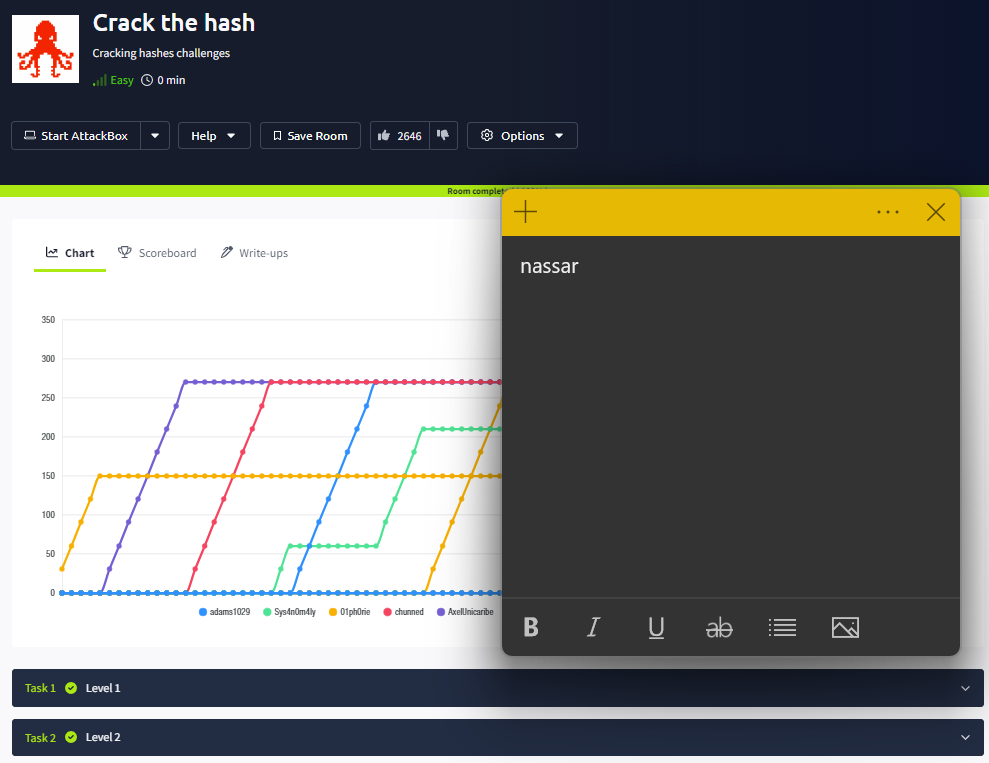
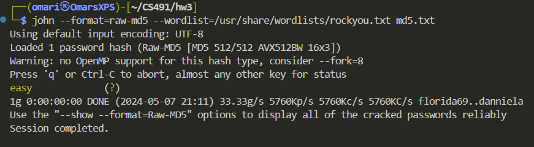
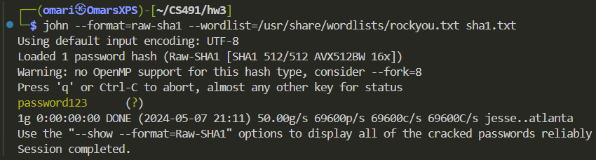
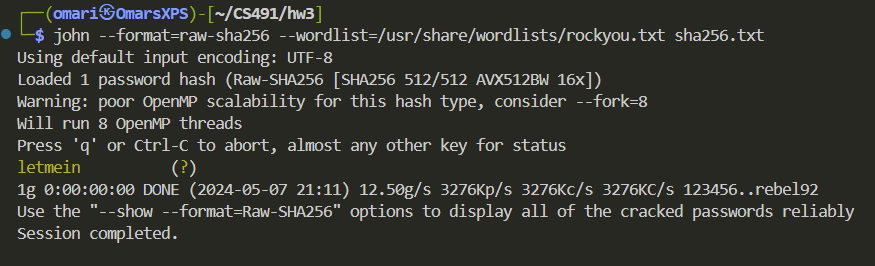
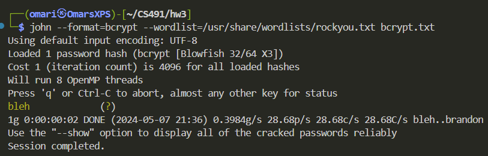
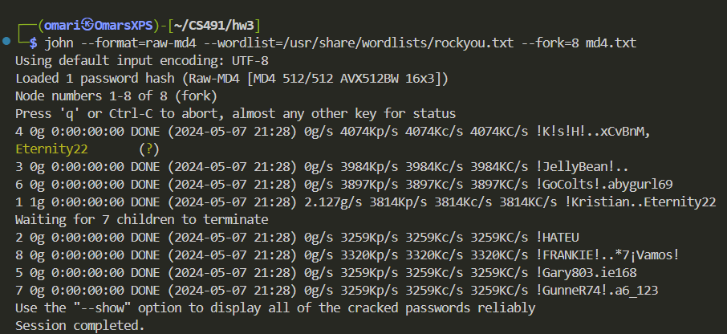
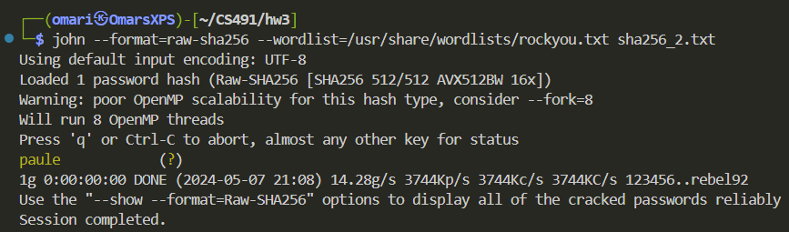
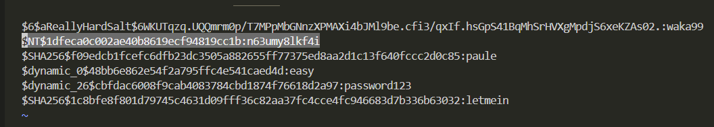
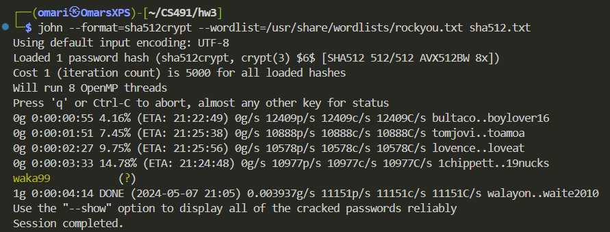
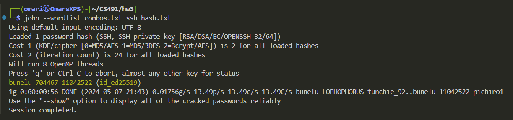

**Odin ID:** nassar

# 1

# 2

## Level 1

1. `john --format=raw-md5 --wordlist=/usr/share/wordlists/rockyou.txt hashes/md5.txt`

2. `john --format=raw-sha1 --wordlist=/usr/share/wordlists/rockyou.txt hashes/sha1.txt`

3. `john --format=raw-sha256 --wordlist=/usr/share/wordlists/rockyou.txt hashes/sha256.txt`

4. `john --format=bcrypt --wordlist=/usr/share/wordlists/rockyou.txt hashes/bcrypt.txt` 

5. `john --format=raw-md4 --wordlist=/usr/share/wordlists/rockyou.txt hashes/md4.txt`

## Level 2

1. `john --format=raw-sha256 --wordlist=/usr/share/wordlists/rockyou.txt hashes/sha256_2.txt`

2. `john --format=nt --wordlist=/usr/share/wordlists/rockyou.txt hashes/nt.txt` (Wouldn't show with `john --show` but showed up in `~/.john/john.pot`)

3. `john --format=sha512crypt --wordlist=/usr/share/wordlists/rockyou.txt hashes/sha512.txt`

4. John cannot solve this one

# 3

1. `awk -f sample.awk -v n=20 /usr/share/wordlists/rockyou.txt > rockyou20.txt`
2. `awk -f sample.awk -v n=3 rockyou20.txt > rockyou3.txt`
3. `sed -i ':a;N;$!ba;s/\n/ /g' input_file`
4. `ssh-keygen -t ed25519 -N "$(cat rockyou3.txt)" -f id_ed25519`
5. `python3 /usr/share/john/ssh2john.py id_ed25519 > hashes/ssh_hash.txt`
6. `hashcat -a 1 -j '$ ' rockyou20.txt rockyou20.txt --stdout > intermediate.txt`
7. `hashcat -a 1 -j '$ ' intermediate.txt rockyou20.txt --stdout > combos.txt`
8. `john --wordlist=combos.txt hashes/ssh_hash.txt`

# 4

John the Ripper does not support this feature. It's exclusive to HashCat.