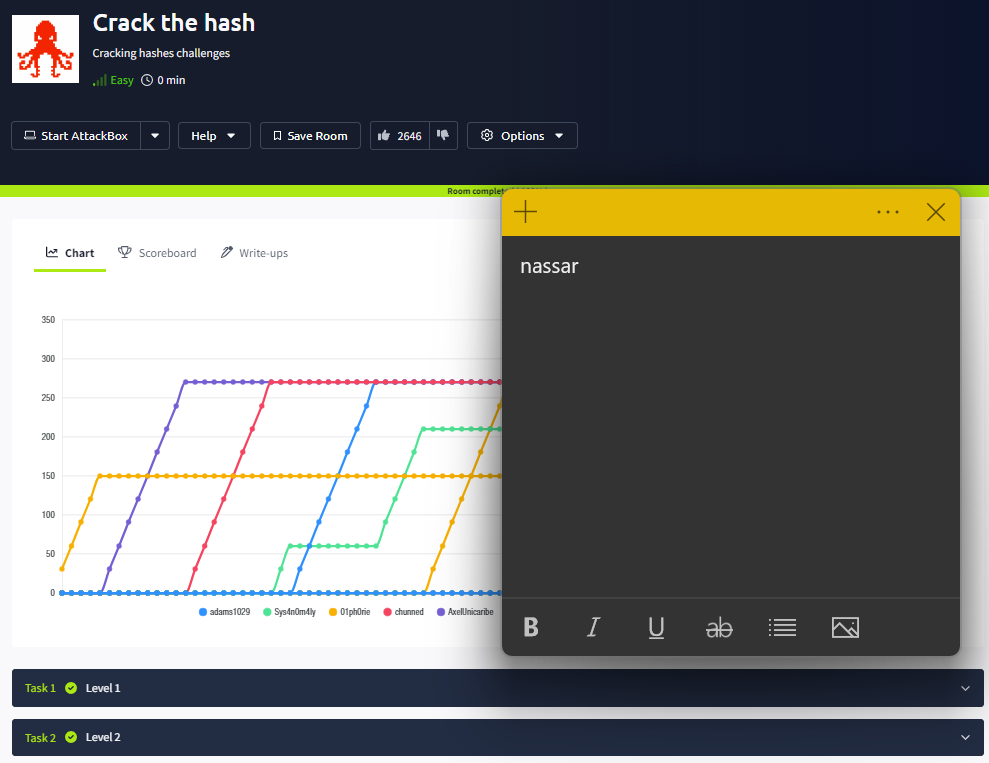

**Odin ID:** nassar

# 1

# 2

## Level 1

1. `john --format=raw-md5 --wordlist=/usr/share/wordlists/rockyou.txt md5.txt`
2. `john --format=raw-sha1 --wordlist=/usr/share/wordlists/rockyou.txt sha1.txt`
3. `john --format=raw-sha256 --wordlist=/usr/share/wordlists/rockyou.txt sha256.txt`
4. `john --format=bcrypt --wordlist=/usr/share/wordlists/rockyou.txt bcrypt.txt`
5. `john --format=raw-md4 --wordlist=/usr/share/wordlists/rockyou.txt md4.txt`

## Level 2

1. `john --format=raw-sha256 --wordlist=/usr/share/wordlists/rockyou.txt sha256_2.txt`
2. `john --format=nt --wordlist=/usr/share/wordlists/rockyou.txt nt.txt`
3. `john --format=sha512crypt --wordlist=/usr/share/wordlists/rockyou.txt sha512.txt`
4. `john --format=HMAC-SHA1 --wordlist=/usr/share/wordlists/rockyou.txt sha1_2.txt`

# 3

# 4