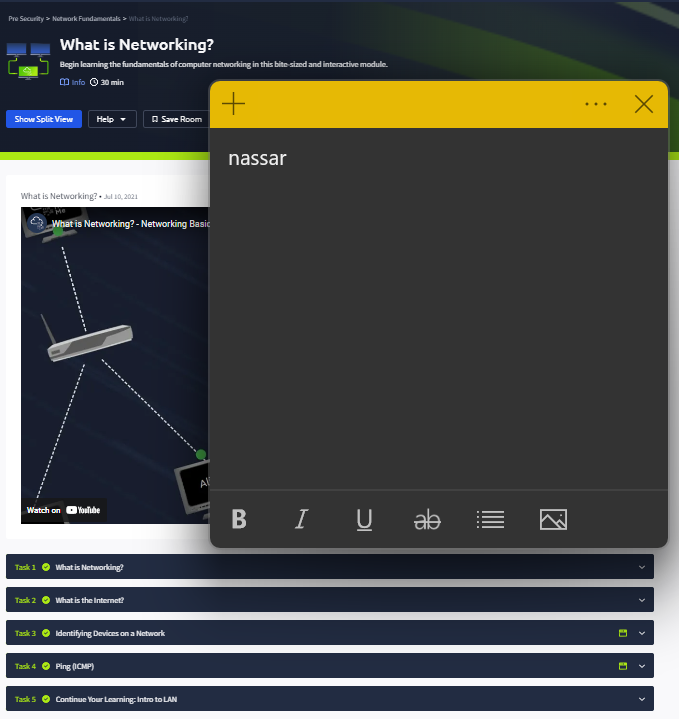
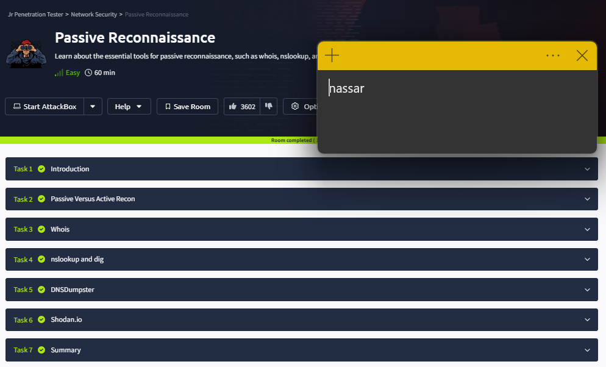
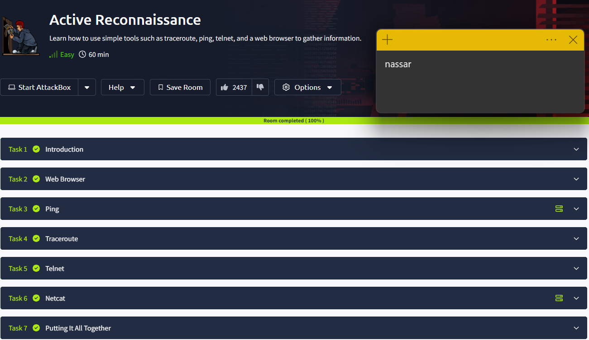
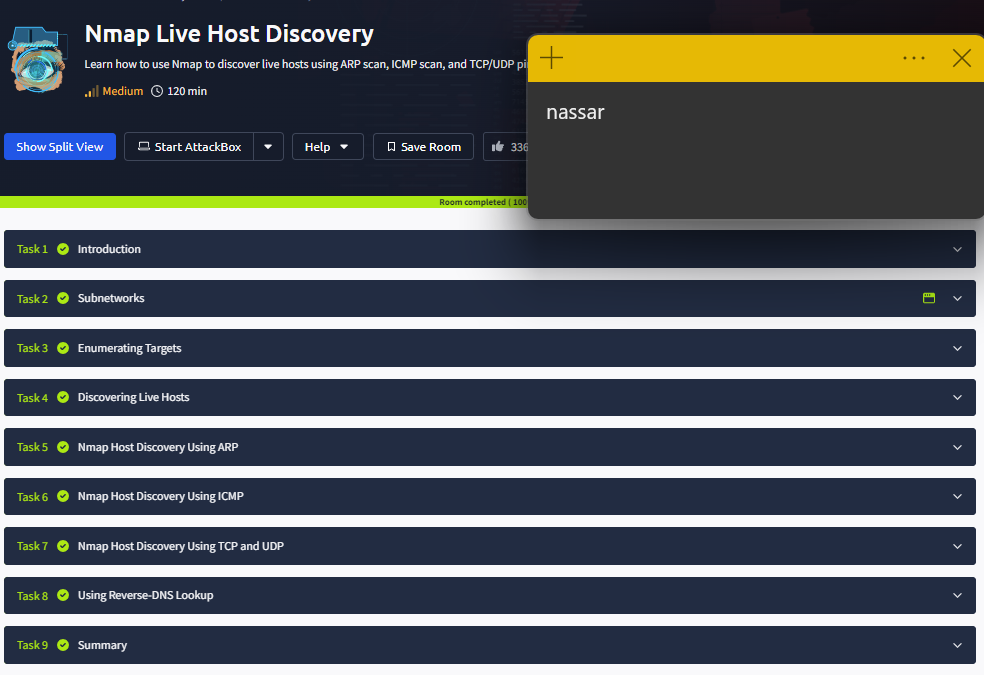

**Odin ID:** nassar

# 1


# 2


# 3


# 4


# 5

1. `sudo tcpdump -nn -xx -tt port 53 -c 10`

```
1716063943.869619 IP 192.168.29.114.57056 > 192.168.16.1.53: 54897+ A? gitlab.cecs.pdx.edu. (37)
	0x0000:  0015 5df6 7ba8 0015 5dd5 7462 0800 4500
	0x0010:  0041 a2c3 4000 4011 e924 c0a8 1d72 c0a8
	0x0020:  1001 dee0 0035 002d af02 d671 0100 0001
	0x0030:  0000 0000 0000 0667 6974 6c61 6204 6365
	0x0040:  6373 0370 6478 0365 6475 0000 0100 01
1716063943.869626 IP 192.168.29.114.57056 > 192.168.16.1.53: 64127+ AAAA? gitlab.cecs.pdx.edu. (37)
	0x0000:  0015 5df6 7ba8 0015 5dd5 7462 0800 4500
	0x0010:  0041 a2c4 4000 4011 e923 c0a8 1d72 c0a8
	0x0020:  1001 dee0 0035 002d af02 fa7f 0100 0001
	0x0030:  0000 0000 0000 0667 6974 6c61 6204 6365
	0x0040:  6373 0370 6478 0365 6475 0000 1c00 01
1716063943.879974 IP 192.168.16.1.53 > 192.168.29.114.57056: 54897- 1/0/0 A 131.252.208.138 (72)
	0x0000:  0015 5dd5 7462 0015 5df6 7ba8 0800 4500
	0x0010:  0064 5703 0000 8011 34c2 c0a8 1001 c0a8
	0x0020:  1d72 0035 dee0 0050 11c1 d671 8100 0001
	0x0030:  0001 0000 0000 0667 6974 6c61 6204 6365
	0x0040:  6373 0370 6478 0365 6475 0000 0100 0106
	0x0050:  6769 746c 6162 0463 6563 7303 7064 7803
	0x0060:  6564 7500 0001 0001 0000 0000 0004 83fc
	0x0070:  d08a
1716063943.929292 IP 192.168.16.1.53 > 192.168.29.114.57056: 64127 0/1/0 (93)
	0x0000:  0015 5dd5 7462 0015 5df6 7ba8 0800 4500
	0x0010:  0079 5704 0000 8011 34ac c0a8 1001 c0a8
	0x0020:  1d72 0035 dee0 0065 2da0 fa7f 8180 0001
	0x0030:  0000 0001 0000 0667 6974 6c61 6204 6365
	0x0040:  6373 0370 6478 0365 6475 0000 1c00 01c0
	0x0050:  1300 0600 0100 0000 d900 2c04 7761 6c74
	0x0060:  0265 65c0 1807 7375 7070 6f72 7403 6361
	0x0070:  74c0 1878 a493 3300 0002 5800 0001 2c00
	0x0080:  1275 0000 0001 2c
1716063944.181875 IP 192.168.29.114.35707 > 192.168.16.1.53: 18212+ A? gitlab.cecs.pdx.edu. (37)
	0x0000:  0015 5df6 7ba8 0015 5dd5 7462 0800 4500
	0x0010:  0041 02cc 4000 4011 891c c0a8 1d72 c0a8
	0x0020:  1001 8b7b 0035 002d af02 4724 0100 0001
	0x0030:  0000 0000 0000 0667 6974 6c61 6204 6365
	0x0040:  6373 0370 6478 0365 6475 0000 0100 01
1716063944.181885 IP 192.168.29.114.35707 > 192.168.16.1.53: 59963+ AAAA? gitlab.cecs.pdx.edu. (37)
	0x0000:  0015 5df6 7ba8 0015 5dd5 7462 0800 4500
	0x0010:  0041 02cd 4000 4011 891b c0a8 1d72 c0a8
	0x0020:  1001 8b7b 0035 002d af02 ea3b 0100 0001
	0x0030:  0000 0000 0000 0667 6974 6c61 6204 6365
	0x0040:  6373 0370 6478 0365 6475 0000 1c00 01
1716063944.183790 IP 192.168.16.1.53 > 192.168.29.114.35707: 18212- 1/0/0 A 131.252.208.138 (72)
	0x0000:  0015 5dd5 7462 0015 5df6 7ba8 0800 4500
	0x0010:  0064 5705 0000 8011 34c0 c0a8 1001 c0a8
	0x0020:  1d72 0035 8b7b 0050 f473 4724 8100 0001
	0x0030:  0001 0000 0000 0667 6974 6c61 6204 6365
	0x0040:  6373 0370 6478 0365 6475 0000 0100 0106
	0x0050:  6769 746c 6162 0463 6563 7303 7064 7803
	0x0060:  6564 7500 0001 0001 0000 0000 0004 83fc
	0x0070:  d08a
1716063944.207054 IP 192.168.16.1.53 > 192.168.29.114.35707: 59963 0/1/0 (93)
	0x0000:  0015 5dd5 7462 0015 5df6 7ba8 0800 4500
	0x0010:  0079 5706 0000 8011 34aa c0a8 1001 c0a8
	0x0020:  1d72 0035 8b7b 0065 9249 ea3b 8180 0001
	0x0030:  0000 0001 0000 0667 6974 6c61 6204 6365
	0x0040:  6373 0370 6478 0365 6475 0000 1c00 01c0
	0x0050:  1300 0600 0100 0000 d800 2c04 7761 6c74
	0x0060:  0265 65c0 1807 7375 7070 6f72 7403 6361
	0x0070:  74c0 1878 a493 3300 0002 5800 0001 2c00
	0x0080:  1275 0000 0001 2c
1716063944.207736 IP 192.168.29.114.51635 > 192.168.16.1.53: 51458+ PTR? 138.208.252.131.in-addr.arpa. (46)
	0x0000:  0015 5df6 7ba8 0015 5dd5 7462 0800 4500
	0x0010:  004a 68cb 4000 4011 2314 c0a8 1d72 c0a8
	0x0020:  1001 c9b3 0035 0036 af0b c902 0100 0001
	0x0030:  0000 0000 0000 0331 3338 0332 3038 0332
	0x0040:  3532 0331 3331 0769 6e2d 6164 6472 0461
	0x0050:  7270 6100 000c 0001
1716063944.209343 IP 192.168.16.1.53 > 192.168.29.114.51635: 51458- 1/0/0 PTR gitlab.cecs.pdx.edu. (107)
	0x0000:  0015 5dd5 7462 0015 5df6 7ba8 0800 4500
	0x0010:  0087 5707 0000 8011 349b c0a8 1001 c0a8
	0x0020:  1d72 0035 c9b3 0073 8f98 c902 8100 0001
	0x0030:  0001 0000 0000 0331 3338 0332 3038 0332
	0x0040:  3532 0331 3331 0769 6e2d 6164 6472 0461
	0x0050:  7270 6100 000c 0001 0331 3338 0332 3038
	0x0060:  0332 3532 0331 3331 0769 6e2d 6164 6472
	0x0070:  0461 7270 6100 000c 0001 0000 0000 0015
	0x0080:  0667 6974 6c61 6204 6365 6373 0370 6478
	0x0090:  0365 6475 00

```

2. `sudo tcpdump -nn 'tcp and (dst port 443 or dst port 8080) and src host 192.168.29.114' -xx -tt -c 10`

```
1716064566.095388 IP 192.168.29.114.55544 > 20.189.173.4.443: Flags [S], seq 1144881901, win 64240, options [mss 1460,sackOK,TS val 4029385106 ecr 0,nop,wscale 7], length 0
	0x0000:  0015 5df6 7ba8 0015 5dd5 7462 0800 4500
	0x0010:  003c 13d9 4000 4006 8707 c0a8 1d72 14bd
	0x0020:  ad04 d8f8 01bb 443d 82ed 0000 0000 a002
	0x0030:  faf0 a00a 0000 0204 05b4 0402 080a f02b
	0x0040:  8992 0000 0000 0103 0307
1716064566.127452 IP 192.168.29.114.55544 > 20.189.173.4.443: Flags [.], ack 1324428206, win 502, options [nop,nop,TS val 4029385138 ecr 2766828828], length 0
	0x0000:  0015 5df6 7ba8 0015 5dd5 7462 0800 4500
	0x0010:  0034 13da 4000 4006 870e c0a8 1d72 14bd
	0x0020:  ad04 d8f8 01bb 443d 82ee 4ef1 2bae 8010
	0x0030:  01f6 a002 0000 0101 080a f02b 89b2 a4ea
	0x0040:  751c
1716064566.128143 IP 192.168.29.114.55544 > 20.189.173.4.443: Flags [P.], seq 0:485, ack 1, win 502, options [nop,nop,TS val 4029385139 ecr 2766828828], length 485
	0x0000:  0015 5df6 7ba8 0015 5dd5 7462 0800 4500
	0x0010:  0219 13db 4000 4006 8528 c0a8 1d72 14bd
	0x0020:  ad04 d8f8 01bb 443d 82ee 4ef1 2bae 8018
	0x0030:  01f6 a1e7 0000 0101 080a f02b 89b3 a4ea
	0x0040:  751c 1603 0101 e001 0001 dc03 038f 026a
	0x0050:  88f6 20a0 f385 852d eb76 3123 5e05 2023
	0x0060:  9094 ca96 71b9 26b4 b335 4118 8420 70bc
	0x0070:  2298 1a98 54b4 5c4b 0f93 5474 7dac feaf
	0x0080:  cb00 ef1f 4a8d d9a0 4ab1 0aca c3d7 0076
	0x0090:  1302 1303 1301 c02f c02b c030 c02c 009e
	0x00a0:  c027 0067 c028 006b 00a3 009f cca9 cca8
	0x00b0:  ccaa c0af c0ad c0a3 c09f c05d c061 c057
	0x00c0:  c053 00a2 c0ae c0ac c0a2 c09e c05c c060
	0x00d0:  c056 c052 c024 006a c023 0040 c00a c014
	0x00e0:  0039 0038 c009 c013 0033 0032 009d c0a1
	0x00f0:  c09d c051 009c c0a0 c09c c050 003d 003c
	0x0100:  0035 002f 00ff 0100 011d 0000 0025 0023
	0x0110:  0000 206d 6f62 696c 652e 6576 656e 7473
	0x0120:  2e64 6174 612e 6d69 6372 6f73 6f66 742e
	0x0130:  636f 6d00 0b00 0403 0001 0200 0a00 1600
	0x0140:  1400 1d00 1700 1e00 1900 1801 0001 0101
	0x0150:  0201 0301 0400 2300 0000 1600 0000 1700
	0x0160:  0000 0d00 2a00 2804 0305 0306 0308 0708
	0x0170:  0808 0908 0a08 0b08 0408 0508 0604 0105
	0x0180:  0106 0103 0303 0103 0204 0205 0206 0200
	0x0190:  2b00 0504 0304 0303 002d 0002 0101 0033
	0x01a0:  0026 0024 001d 0020 ea9d db3e ade4 cc5e
	0x01b0:  82ed 24ef d10d 3c4c 4df3 8e13 b4ff b221
	0x01c0:  41a7 badf c981 2d38 0029 005b 0026 0020
	0x01d0:  ae3a 0000 0132 25a0 4feb 2108 323e 59dd
	0x01e0:  fca4 c9d9 2fc0 e111 8483 8c1d 62ad 1b5d
	0x01f0:  9757 e424 0031 3048 7e57 756e 2d04 b177
	0x0200:  00fd 22be aef2 b5cf d1bb d2ec d334 ba53
	0x0210:  1f0f ff5f e3c0 628b 8a2a 530f 81b5 c999
	0x0220:  f03a 2789 fdfb fd
1716064566.225383 IP 192.168.29.114.55544 > 20.189.173.4.443: Flags [.], ack 100, win 502, options [nop,nop,TS val 4029385236 ecr 2766828925], length 0
	0x0000:  0015 5df6 7ba8 0015 5dd5 7462 0800 4500
	0x0010:  0034 13dc 4000 4006 870c c0a8 1d72 14bd
	0x0020:  ad04 d8f8 01bb 443d 84d3 4ef1 2c11 8010
	0x0030:  01f6 a002 0000 0101 080a f02b 8a14 a4ea
	0x0040:  757d
1716064566.226824 IP 192.168.29.114.55544 > 20.189.173.4.443: Flags [P.], seq 485:1041, ack 100, win 502, options [nop,nop,TS val 4029385238 ecr 2766828925], length 556
	0x0000:  0015 5df6 7ba8 0015 5dd5 7462 0800 4500
	0x0010:  0260 13dd 4000 4006 84df c0a8 1d72 14bd
	0x0020:  ad04 d8f8 01bb 443d 84d3 4ef1 2c11 8018
	0x0030:  01f6 a22e 0000 0101 080a f02b 8a16 a4ea
	0x0040:  757d 1403 0300 0101 1603 0302 2101 0002
	0x0050:  1d03 038f 026a 88f6 20a0 f385 852d eb76
	0x0060:  3123 5e05 2023 9094 ca96 71b9 26b4 b335
	0x0070:  4118 8420 70bc 2298 1a98 54b4 5c4b 0f93
	0x0080:  5474 7dac feaf cb00 ef1f 4a8d d9a0 4ab1
	0x0090:  0aca c3d7 0076 1302 1303 1301 c02f c02b
	0x00a0:  c030 c02c 009e c027 0067 c028 006b 00a3
	0x00b0:  009f cca9 cca8 ccaa c0af c0ad c0a3 c09f
	0x00c0:  c05d c061 c057 c053 00a2 c0ae c0ac c0a2
	0x00d0:  c09e c05c c060 c056 c052 c024 006a c023
	0x00e0:  0040 c00a c014 0039 0038 c009 c013 0033
	0x00f0:  0032 009d c0a1 c09d c051 009c c0a0 c09c
	0x0100:  c050 003d 003c 0035 002f 00ff 0100 015e
	0x0110:  0000 0025 0023 0000 206d 6f62 696c 652e
	0x0120:  6576 656e 7473 2e64 6174 612e 6d69 6372
	0x0130:  6f73 6f66 742e 636f 6d00 0b00 0403 0001
	0x0140:  0200 0a00 1600 1400 1d00 1700 1e00 1900
	0x0150:  1801 0001 0101 0201 0301 0400 2300 0000
	0x0160:  1600 0000 1700 0000 0d00 2a00 2804 0305
	0x0170:  0306 0308 0708 0808 0908 0a08 0b08 0408
	0x0180:  0508 0604 0105 0106 0103 0303 0103 0204
	0x0190:  0205 0206 0200 2b00 0504 0304 0303 002d
	0x01a0:  0002 0101 0033 0067 0065 0018 0061 0425
	0x01b0:  1754 4f4e 224e 6b42 1d08 fc91 c63c 9fcf
	0x01c0:  2183 e70a 3c0f 9f45 03de 5c01 e2d7 8caa
	0x01d0:  bbd9 87d3 c535 8ad9 99b6 ac80 e02a a0b6
	0x01e0:  401a 5010 849a 6d96 0539 938a 86ea ebf5
	0x01f0:  0279 fec8 0d27 5bfe aa04 4dc3 6f06 359e
	0x0200:  a4a0 4ad8 bf6b 7f88 a118 181c 1de4 0900
	0x0210:  2900 5b00 2600 20ae 3a00 0001 3225 a04f
	0x0220:  eb21 0832 3e59 ddfc a4c9 d92f c0e1 1184
	0x0230:  838c 1d62 ad1b 5d97 57e4 2400 3130 e734
	0x0240:  81c0 56d9 1638 9093 4cf4 7ec6 957f a9aa
	0x0250:  d0cd 19a7 8ce4 8460 2e9b ba30 51cb 6c48
	0x0260:  0d90 7867 3fe6 611d 1b11 e4c2 1d37
1716064566.330543 IP 192.168.29.114.55544 > 20.189.173.4.443: Flags [.], ack 4632, win 501, options [nop,nop,TS val 4029385342 ecr 2766829028], length 0
	0x0000:  0015 5df6 7ba8 0015 5dd5 7462 0800 4500
	0x0010:  0034 13de 4000 4006 870a c0a8 1d72 14bd
	0x0020:  ad04 d8f8 01bb 443d 86ff 4ef1 3dc5 8010
	0x0030:  01f5 a002 0000 0101 080a f02b 8a7e a4ea
	0x0040:  75e4
1716064566.336904 IP 192.168.29.114.55544 > 20.189.173.4.443: Flags [P.], seq 1041:2384, ack 4632, win 501, options [nop,nop,TS val 4029385348 ecr 2766829028], length 1343
	0x0000:  0015 5df6 7ba8 0015 5dd5 7462 0800 4500
	0x0010:  0573 13df 4000 4006 81ca c0a8 1d72 14bd
	0x0020:  ad04 d8f8 01bb 443d 86ff 4ef1 3dc5 8018
	0x0030:  01f5 a541 0000 0101 080a f02b 8a84 a4ea
	0x0040:  75e4 1703 0300 456f 659a 67e2 95da 002e
	0x0050:  ba60 5c1b 3e37 ad9d cdf9 6411 c8c0 eba2
	0x0060:  49ed cd9d dba3 afc5 22bf 6605 81e1 63da
	0x0070:  1d93 2506 a231 f7af edda c3de 5b83 1966
	0x0080:  7fc3 2b38 4b67 6db0 daec 2934 1703 0304
	0x0090:  f039 c18e f1a5 ac75 be53 2bf3 ba06 2049
	0x00a0:  0c24 0222 e625 74cd d59b 3b72 50fd 7db6
	0x00b0:  02ed 713c e9b2 a90b 4d35 59c3 d251 7d05
	0x00c0:  23cc e465 3c32 6ab6 ea98 054c 88a7 1c7b
	0x00d0:  1a9f 1dab fbc3 b353 99d9 c255 be54 15c5
	0x00e0:  2960 964b 1a63 40c5 ff17 0634 54fd 413b
	0x00f0:  a39d 69d1 03a9 8f7c b564 2d79 f4b2 7877
	0x0100:  7801 b5ba bcd8 5893 31e6 41c5 1b53 1782
	0x0110:  898f c230 b656 79db 24af 7ff9 6553 2ef8
	0x0120:  33a5 9a2d 2edb ac11 488d e643 69f4 8821
	0x0130:  44af bd6a 5170 a94c 9ba1 795b 4f59 6387
	0x0140:  4cf3 1869 1376 9c25 e0e6 2b48 8316 483e
	0x0150:  7d9d 4df6 03e3 a98d a3c6 2f11 c353 662c
	0x0160:  51ba 0240 895c f605 cca6 13ce dac0 d338
	0x0170:  aa62 4d4a 1f01 bd1c 5b22 cfcd 46b3 6d47
	0x0180:  e100 2fe1 cb8a 33d1 88c0 c122 4dfc 273a
	0x0190:  e1d7 5b8f 43c8 57b0 1d31 90c6 aed1 cefc
	0x01a0:  88d3 9b5e 6660 38ef 9c7b 0fec 69c5 4d78
	0x01b0:  4527 d9d2 b2ba 0f7e 964e 5f34 e877 c732
	0x01c0:  3efa 40e0 93a1 a5fb 5b84 7243 4aac 4fe0
	0x01d0:  bbc7 46c6 1cd5 7450 fce7 673b 9066 d7c4
	0x01e0:  97ac 2950 bbba bbb7 0907 7d0f 0d77 30f9
	0x01f0:  250b aff5 861c e02f 9c7f e475 5414 c2c7
	0x0200:  7b4a 5800 c67a de2c d31f 04fe 893a 85c1
	0x0210:  8de7 6958 7e1f 9a3f c6d7 e03a d0cf e1bb
	0x0220:  7eb8 741b ff55 b59f 0dcb 9be3 e1c2 3ad0
	0x0230:  c6b1 9284 341b bcb0 3301 f9db 30d1 a7e1
	0x0240:  1a70 5645 e418 94f1 4d5a 2051 fb8d 389a
	0x0250:  4c9d 6b1c 8829 6674 d22b b8f2 bec6 cfb8
	0x0260:  76b6 d0e0 be5f 6902 4fdf 16ef c570 8f8b
	0x0270:  bd85 25a4 2abd 5aad e90c a9b9 d031 3188
	0x0280:  2303 de13 772d 1ac3 cbe5 a76b e5e6 da6f
	0x0290:  cd89 96e6 e98c ffea d7c7 be78 4503 4c70
	0x02a0:  172d 1a6e abfa a9cd b2ab f27c fb7b 25e5
	0x02b0:  df19 fc7f 6eda 9b44 3dda 0a77 97df 0c82
	0x02c0:  69da a53b 9a85 a9fd 4c13 b073 374c c5f7
	0x02d0:  0446 5106 27a9 a0f9 d87e eba4 9c3b 0bac
	0x02e0:  7e52 abd7 90f0 cb4c 4f96 5c10 783c 0480
	0x02f0:  35c4 dff8 dedf b643 d4d6 74a6 9834 8f64
	0x0300:  ff13 69a3 05fb 7822 97b7 cee0 dfbc 7922
	0x0310:  5c3c 83a4 205c 1be4 a91f bafd 7a51 d921
	0x0320:  1249 5aeb 5852 64f1 e6d3 ac8d e583 07de
	0x0330:  75d0 8104 0855 d008 0fa8 36a9 0bf6 752b
	0x0340:  09af 98a6 e499 340a 04ba f9e5 7b7c abab
	0x0350:  aeb1 6f9e e4fd 3c4a c773 e2ac c841 33fd
	0x0360:  4b29 fb06 d22b b39f ffaa 8a12 ccb2 10ab
	0x0370:  824f a5f9 d8e5 7deb 199f 1e91 335c e647
	0x0380:  500c 6362 3865 a2cd d217 cf58 6077 26af
	0x0390:  056e 340d a637 0a16 ecbb 56c3 a2a9 4b67
	0x03a0:  ff66 e166 f83b dc02 2a29 a043 786e 20fa
	0x03b0:  8488 440e 12a3 1fa9 983b caaf a8d3 1e51
	0x03c0:  5d00 de30 53e1 b884 dc7c d7dc 040d f8aa
	0x03d0:  43bd d961 bb54 70b8 b7d4 e947 f649 fbb5
	0x03e0:  847c 8538 346f 5e7d a4c7 7cb6 9602 ef1f
	0x03f0:  8431 c68e 0e77 a9eb 4713 7c37 fe66 fb93
	0x0400:  1e98 f1a9 d617 4ffc adfd 558a bb39 ee21
	0x0410:  8553 3bc1 b4a9 5ac2 2305 144c 586a c542
	0x0420:  4a6d da73 7a40 7ca8 f50d 4086 c8fb a397
	0x0430:  7f20 2470 c433 7ecc 13bc 2a88 9b32 f94c
	0x0440:  d4e2 0e20 35dd e797 bc93 8f1a 3605 1751
	0x0450:  d6a9 fa16 3965 4180 4a5e 3283 6aee 2122
	0x0460:  45c6 1fee 3ba5 cf39 07cd 0bcc 8cb2 8f50
	0x0470:  e0b6 cde4 38f2 7cf5 fde2 e9f3 75b3 b9fb
	0x0480:  22be 3186 8dc4 bc5c 10fd 4a0a 5166 19d7
	0x0490:  7e40 01bd 5124 dfcf 81ff 624a ce72 3754
	0x04a0:  ff3f 50b3 e8f4 7f83 868a 3ed9 0cd5 a25f
	0x04b0:  f44f 28ef 63ec 64ed 81ab ac6b 92bb 6afd
	0x04c0:  aa82 5015 3420 f5b5 e58e 94fb d80e b6e7
	0x04d0:  9caf 831a dad8 2ea5 7547 0577 8286 7da0
	0x04e0:  50fc 7fec da87 fae2 5d10 3343 d098 ef7e
	0x04f0:  67f4 1bec 8137 97ee 803a aea0 c466 6321
	0x0500:  93ad a6c5 dafb ee12 8b0d f6b3 7f32 a2f4
	0x0510:  30ca 92cc ce3b e075 6eaf 5765 691b 5e64
	0x0520:  8f29 3c28 0d75 0c2a d3d3 2e99 58b7 a0f7
	0x0530:  8aba 6ddc b9e9 a108 a7c8 a2e4 bb8a 51ba
	0x0540:  b02b ceb8 2018 460f 6917 01e0 ab0b ec0a
	0x0550:  dfc2 5b9a 3236 f021 1316 45ed fba3 d62f
	0x0560:  fcfd 488e 9e53 1ba5 9d36 471c 42c8 c1ea
	0x0570:  9512 e063 86f8 d92a 5595 1e2f 0d37 acb9
	0x0580:  0c
1716064566.437499 IP 192.168.29.114.55544 > 20.189.173.4.443: Flags [.], ack 4735, win 501, options [nop,nop,TS val 4029385449 ecr 2766829080], length 0
	0x0000:  0015 5df6 7ba8 0015 5dd5 7462 0800 4500
	0x0010:  0034 13e0 4000 4006 8708 c0a8 1d72 14bd
	0x0020:  ad04 d8f8 01bb 443d 8c3e 4ef1 3e2c 8010
	0x0030:  01f5 a002 0000 0101 080a f02b 8ae9 a4ea
	0x0040:  7618
1716064566.759680 IP 192.168.29.114.55544 > 20.189.173.4.443: Flags [P.], seq 2384:2408, ack 5201, win 501, options [nop,nop,TS val 4029385771 ecr 2766829255], length 24
	0x0000:  0015 5df6 7ba8 0015 5dd5 7462 0800 4500
	0x0010:  004c 13e1 4000 4006 86ef c0a8 1d72 14bd
	0x0020:  ad04 d8f8 01bb 443d 8c3e 4ef1 3ffe 8018
	0x0030:  01f5 a01a 0000 0101 080a f02b 8c2b a4ea
	0x0040:  76c7 1703 0300 136b e55e 8678 543b 6d41
	0x0050:  0974 3d43 3336 cb9a f149
1716064566.759767 IP 192.168.29.114.55544 > 20.189.173.4.443: Flags [F.], seq 2408, ack 5201, win 501, options [nop,nop,TS val 4029385771 ecr 2766829255], length 0
	0x0000:  0015 5df6 7ba8 0015 5dd5 7462 0800 4500
	0x0010:  0034 13e2 4000 4006 8706 c0a8 1d72 14bd
	0x0020:  ad04 d8f8 01bb 443d 8c56 4ef1 3ffe 8011
	0x0030:  01f5 a002 0000 0101 080a f02b 8c2b a4ea
	0x0040:  76c7
```

3. `sudo tcpdump -nn '(tcp or udp) and dst portrange 20000-35000 and dst host 192.168.29.114' -xx -tt -c 10`

```
1716065042.624767 IP 192.168.16.1.53 > 192.168.29.114.34404: 9386- 1/0/0 A 131.252.208.138 (72)
	0x0000:  0015 5dd5 7462 0015 5df6 7ba8 0800 4500
	0x0010:  0064 5796 0000 8011 342f c0a8 1001 c0a8
	0x0020:  1d72 0035 8664 0050 1c05 24aa 8100 0001
	0x0030:  0001 0000 0000 0667 6974 6c61 6204 6365
	0x0040:  6373 0370 6478 0365 6475 0000 0100 0106
	0x0050:  6769 746c 6162 0463 6563 7303 7064 7803
	0x0060:  6564 7500 0001 0001 0000 0000 0004 83fc
	0x0070:  d08a
1716065042.648509 IP 192.168.16.1.53 > 192.168.29.114.34404: 58534 0/1/0 (93)
	0x0000:  0015 5dd5 7462 0015 5df6 7ba8 0800 4500
	0x0010:  0079 5797 0000 8011 3419 c0a8 1001 c0a8
	0x0020:  1d72 0035 8664 0065 5df5 e4a6 8180 0001
	0x0030:  0000 0001 0000 0667 6974 6c61 6204 6365
	0x0040:  6373 0370 6478 0365 6475 0000 1c00 01c0
	0x0050:  1300 0600 0100 0001 1700 2c04 7761 6c74
	0x0060:  0265 65c0 1807 7375 7070 6f72 7403 6361
	0x0070:  74c0 1878 a493 3300 0002 5800 0001 2c00
	0x0080:  1275 0000 0001 2c
1716065043.006891 IP 20.189.173.10.443 > 192.168.29.114.33004: Flags [S.], seq 2343854173, ack 237686017, win 65535, options [mss 1440,nop,wscale 8,sackOK,TS val 2710508311 ecr 3790577139], length 0
	0x0000:  0015 5dd5 7462 0015 5df6 7ba8 0800 4500
	0x0010:  003c 19ff 4000 7006 50db 14bd ad0a c0a8
	0x0020:  1d72 01bb 80ec 8bb4 605d 0e2a cd01 a012
	0x0030:  ffff 29b2 0000 0204 05a0 0103 0308 0402
	0x0040:  080a a18f 1317 e1ef 9df3
1716065043.041276 IP 20.189.173.10.443 > 192.168.29.114.33004: Flags [P.], seq 1:100, ack 486, win 16384, options [nop,nop,TS val 2710508344 ecr 3790577172], length 99
	0x0000:  0015 5dd5 7462 0015 5df6 7ba8 0800 4500
	0x0010:  0097 1a00 4000 7006 507f 14bd ad0a c0a8
	0x0020:  1d72 01bb 80ec 8bb4 605e 0e2a cee6 8018
	0x0030:  4000 4c2d 0000 0101 080a a18f 1338 e1ef
	0x0040:  9e14 1603 0300 5802 0000 5403 03cf 21ad
	0x0050:  74e5 9a61 11be 1d8c 021e 65b8 91c2 a211
	0x0060:  167a bb8c 5e07 9e09 e2c8 a833 9c20 c941
	0x0070:  be18 a627 536c c9f5 a183 e650 15f6 9170
	0x0080:  1416 ba82 554c a6b3 771f 1a62 985e 1302
	0x0090:  0000 0c00 2b00 0203 0400 3300 0200 1814
	0x00a0:  0303 0001 01
1716065043.101186 IP 20.189.173.10.443 > 192.168.29.114.33004: Flags [P.], seq 100:4632, ack 1042, win 16382, options [nop,nop,TS val 2710508405 ecr 3790577209], length 4532
	0x0000:  0015 5dd5 7462 0015 5df6 7ba8 0800 4500
	0x0010:  11e8 1a01 4000 7006 3f2d 14bd ad0a c0a8
	0x0020:  1d72 01bb 80ec 8bb4 60c1 0e2a d112 8018
	0x0030:  3ffe b1bc 0000 0101 080a a18f 1375 e1ef
	0x0040:  9e39 1603 0300 bb02 0000 b703 038e 96c4
	0x0050:  aada 8f4f e10c 0392 1acf 9880 600f e097
	0x0060:  50e4 ea09 17f1 dade a29e f59d 5020 c941
	0x0070:  be18 a627 536c c9f5 a183 e650 15f6 9170
	0x0080:  1416 ba82 554c a6b3 771f 1a62 985e 1302
	0x0090:  0000 6f00 2b00 0203 0400 3300 6500 1800
	0x00a0:  6104 d4f2 4b0e d5d3 d76a 7415 f0a3 f9b4
	0x00b0:  60b0 72a5 98e2 0cda 1d53 d897 e9cb 9128
	0x00c0:  32f5 5c6b 5337 0905 a41c 9ee0 ff92 ddb3
	0x00d0:  f2eb 3fb2 c9b9 5877 073d 2815 ca5e 5985
	0x00e0:  3f8e fdbe 1006 aee6 9c20 7171 b2f8 d566
	0x00f0:  8215 4eb8 f18a 899e 04ac d8a7 2e32 304c
	0x0100:  d49d 1703 0310 efa7 e958 356f bbce b08f
	0x0110:  e562 9642 6328 5110 a741 730c 114e 6369
	0x0120:  b23f 2d01 fe33 e2ef 279f ae6f d27f 5270
	0x0130:  3255 e62f 47a1 5eaa 1609 57d0 d56d 69ff
	0x0140:  e181 b5e3 1f01 a108 cd07 d3bd 8c9f dfb5
	0x0150:  198b eb04 8e2c 5299 1d6b c307 e789 dec0
	0x0160:  33ca c1fd c191 8997 715a 99d2 6b64 80b2
	0x0170:  6956 444a 43a8 e484 20ca 6a10 aa03 2aaf
	0x0180:  a6f5 a212 65df b989 bc91 34f1 b83a 8b21
	0x0190:  579e b335 f702 57f6 ec09 3909 cfeb 982d
	0x01a0:  f605 a9b3 452a d2d3 8be9 5700 5bd2 1c03
	0x01b0:  2356 8c80 4c5d c8cc d549 4015 eed8 4266
	0x01c0:  7d77 c0ae 12f9 06d0 39f5 ac66 d861 52c0
	0x01d0:  4495 e289 38b6 baf3 31ae 44a4 c9ea 14b3
	0x01e0:  001d 72b4 59c8 46dd ecc5 8de9 e4c1 ff6a
	0x01f0:  5be3 3846 aeef 2fc5 884a 4e8a d7f6 0480
	0x0200:  4e8e 1e2c 822d 462e cddf 9243 b361 a404
	0x0210:  8c87 1193 32e5 da4f 37be ed7b ba63 0b8d
	0x0220:  f7da 2c5b 5bc0 21cd 5ccf 7bb8 8fd4 e465
	0x0230:  f02d d92a a31d 7068 65fe 37c7 1e6d fddb
	0x0240:  d4b1 60a6 2a9e 232e c74a bf7c 153e a1df
	0x0250:  cd92 4718 77f2 5515 07d4 7b4c 2db7 78bf
	0x0260:  da2f 064f 2068 dc17 9e6d e074 09b2 dd4e
	0x0270:  ab20 1665 c12c 5210 bfc5 cc9f ae14 fc99
	0x0280:  6037 4ee3 93f2 60c6 5f50 d6c3 a03d c5ec
	0x0290:  a014 f25a 64a5 87d7 7f5c d7fb 54f2 36fe
	0x02a0:  5c5c 4050 e2fb d676 c059 1f80 5060 0df4
	0x02b0:  3752 d699 77c1 4f16 17f5 2ba9 0647 cc92
	0x02c0:  76ee c3e3 e1a3 8397 717a d69e da28 b05b
	0x02d0:  a168 c273 05d4 f814 ad97 39d5 eb17 7f43
	0x02e0:  8808 d366 0464 6387 bdde ae21 c971 5a5b
	0x02f0:  afc5 c54e 863f b98b 3fe7 7d57 20d5 9255
	0x0300:  c258 97c3 7e6a aa3a abda 46fb a8f8 c2c7
	0x0310:  ef93 8e35 2b2d 256f c054 ec7a 84c6 b562
	0x0320:  872b 3c51 e677 3fc0 75b5 a1d5 f517 f5bd
	0x0330:  5681 7896 c0c9 7709 f318 4843 393b c92d
	0x0340:  a049 441b 731d 224d f547 dba1 0adc 0f7e
	0x0350:  b96c 4457 adf8 4a37 fb58 14ff 4769 8457
	0x0360:  db0c 8d92 4567 ef17 b277 21fa 7865 218d
	0x0370:  020e 40e0 1470 82e0 08f9 2b75 140e 0e82
	0x0380:  adb5 71cf 6df8 b741 fe38 4b65 6bb1 686b
	0x0390:  ea12 dafe 2d3f 7c8a d23b 8d7a 3054 d135
	0x03a0:  5e24 bed0 6c4d c245 3549 5a68 cd4b 4a72
	0x03b0:  2909 3962 2a0d 5329 f691 b304 0cb7 ec4c
	0x03c0:  46de 7ba9 5f98 40c2 2a49 f7bc 9a57 25aa
	0x03d0:  0972 3101 0cf7 209d dfb2 2b88 63ba 5685
	0x03e0:  7ccd 6552 5bc1 d9f2 2b3b b3f8 11f1 02d5
	0x03f0:  0b17 62a6 c73e c78a 15b9 721b 5df8 33db
	0x0400:  9e76 9718 5fb7 310f a255 b55e 6418 45d0
	0x0410:  9263 7a62 a165 27bf 946b 8ced a68d b7e9
	0x0420:  f815 c3b7 385d 131a 0906 3c43 f1c2 4b9b
	0x0430:  0dea c950 e774 59db 8067 0ca3 5f78 2972
	0x0440:  d76e c065 5f0c 5e4c 51ae 99f8 15ce 9192
	0x0450:  7ab7 6b49 88a8 abfa 53d7 8902 4d32 c78e
	0x0460:  2c2e 1bc8 1822 828a efff dd22 8517 1090
	0x0470:  9135 331a 7cdf ecc4 9a09 6a10 536b 4198
	0x0480:  0c26 6c5e 8824 3944 d4c4 f1be 6714 1954
	0x0490:  8449 c2ce 6e92 a946 2fd4 40a3 b50a 1a0a
	0x04a0:  d7d7 27f4 35f8 8c2f 58a1 bc19 c34e 9142
	0x04b0:  c354 f52b bcd7 3ffe ff10 0821 b065 8cb9
	0x04c0:  a1c9 993e f861 f721 324f 4d77 7613 ee0a
	0x04d0:  0ac5 f56d f32e 51c3 ecfe 7262 585b ea87
	0x04e0:  73e6 6db9 c22c 44a6 d0ee a13f 3352 b032
	0x04f0:  8ed5 5ba2 6e22 2f7b 29af abe5 2ba3 ba6f
	0x0500:  7765 f224 e8c9 a07a 19e5 09e0 c279 bd8d
	0x0510:  a9df 499e 3fa5 9c23 3f9b e5f9 9374 0b2b
	0x0520:  0f2c 2184 d30f 1dea d333 13ac 1126 46da
	0x0530:  2cdd caa6 6178 d525 723b e625 481f 141f
	0x0540:  e090 76e6 33ce 1c03 a9b1 3cc5 8e4a fd90
	0x0550:  2e05 c722 46ae 9ad8 7a95 d377 39a1 01f3
	0x0560:  cfec c6bb a1e7 e896 bad7 67b3 c393 4c56
	0x0570:  d829 cad8 0c4d 4e24 5c05 e77c 9172 5151
	0x0580:  8614 1ad1 14f9 2ce9 10af 7cbe 5536 a940
	0x0590:  f3c8 a9ab c10a 3842 3cb6 59f0 2200 c9b2
	0x05a0:  4bbf 6c5c 5d89 2512 88fb 5ad9 f162 b56f
	0x05b0:  75fc e850 a5fa 46cf fc49 c402 a45f 72f2
	0x05c0:  943c 5742 dc26 9884 4c3e ba08 91c6 442a
	0x05d0:  1ca0 429f c3b5 7bff b0c0 a2d5 f866 1538
	0x05e0:  2a5f 3f6f 3100 22b0 1466 c0fb 49d5 99ef
	0x05f0:  898b d3a2 4eb4 a65a 8382 510b 3a18 7e3b
	0x0600:  514a e5b5 635e a884 a16c 414d dcaa ddc0
	0x0610:  e298 1487 d806 d0a7 8564 59cd 1fda 4591
	0x0620:  7336 c5c5 22c2 a6f1 d8ce 1bdc 4490 9f4a
	0x0630:  eb0a 7316 0721 b78e 1abf 4df1 78ac 4f37
	0x0640:  1a7e 0742 0127 cc30 0dbc 437f 87e7 8f98
	0x0650:  75e6 3a7f c5d6 aa0b 627b c762 d5aa 86a6
	0x0660:  93fc aa15 f0fd 9850 fab4 14fb 82ed 2948
	0x0670:  cfdc bce3 0b47 087a 985f 3585 8459 b549
	0x0680:  2668 fd34 5d28 817c 2465 408b d5af 1848
	0x0690:  018d 1320 a5d0 fbc0 b840 31d2 f965 c91b
	0x06a0:  dcfb a4be b02b cf62 ee07 3c4c 4c3d 12eb
	0x06b0:  3b1e 201a 7f31 83f3 9986 db00 580d 4aa5
	0x06c0:  0f9a 0583 98f4 efde 0156 8b02 ffff 2d46
	0x06d0:  1530 7b20 afe3 e571 ddda df23 c863 6426
	0x06e0:  9dac 4c08 f84c 1999 19eb 5c7e 6229 cf76
	0x06f0:  37dd 9bb6 65a1 2610 ad52 3105 5edf 2e55
	0x0700:  12cb cb84 c67f 1df4 b966 935f 60cc beed
	0x0710:  f5b9 bcd1 d8d8 6f12 afa3 dc46 954f 0de5
	0x0720:  0775 be38 3287 906c 983c 51c2 c226 7d73
	0x0730:  7b08 0d61 7e25 ea87 54a2 6b5d 9939 6fca
	0x0740:  39a7 519c ff6f 6d0c 03e4 e39a 766b 978c
	0x0750:  93db a86a 8544 4976 ebaf 4d45 9848 67d3
	0x0760:  595c 1d37 9206 7bab a1ef b895 60c4 2c66
	0x0770:  3d6d 5a2f 838d 588f 74f7 5abc cb22 838a
	0x0780:  ece6 69fc f5d9 03ac 886a 2bec 0aee 623e
	0x0790:  c342 9aa4 35f2 c503 0922 82b7 8445 cf81
	0x07a0:  ded5 b667 760d 9f35 81dd ee4b aebd 1628
	0x07b0:  008c 6173 74ba 33aa 516d 731b ec55 b635
	0x07c0:  3a40 c35f 5d0d 717d a458 2bdf ab18 0872
	0x07d0:  d814 2313 4f70 3a47 e62d eb2d 615a 2236
	0x07e0:  d206 74a9 2aaa fced b522 c31e 3fc0 4e3e
	0x07f0:  0a73 420d 4460 9d12 1f32 ea35 f0a2 6196
	0x0800:  5352 0fa7 c619 fa4b ed70 f76a 170b a694
	0x0810:  73b0 db6a 79ec 96f0 8104 97f0 a4ec 54ab
	0x0820:  5a00 4c65 5ba5 d502 76c4 162b 4e1f 2dad
	0x0830:  3138 9f3e c2c5 4eed 8cbc d356 b57e 8dbe
	0x0840:  61e1 62be be19 0f70 f67c 35f0 e808 ca9c
	0x0850:  2e1e f5ae 4535 b2f7 d714 b777 78eb 4e93
	0x0860:  edb9 c396 4c02 5082 c726 9ab6 cc7e 5ab5
	0x0870:  d90f 8be7 76c8 0ca4 8786 ca18 40d8 e9f4
	0x0880:  6b19 15ed 2e77 e767 02f9 1612 26a5 575a
	0x0890:  d443 5c5c cb70 9d28 bf44 376a e259 e6fe
	0x08a0:  13aa 2bab c4ed 0282 79dc b280 a8b1 d30c
	0x08b0:  7ac0 bb5d 07d9 a8f0 4ae1 b2d0 d9ed 9f98
	0x08c0:  ad17 6508 7c60 b16f 7d9a 866e 2f73 7345
	0x08d0:  0f81 78a4 5538 1ab3 e2c2 cdcb 93b6 708d
	0x08e0:  8598 2572 0aa8 6a3a 4af3 20cc 538a 5ea3
	0x08f0:  1f1b 5ec4 1120 3119 ef34 d140 e46f 5f87
	0x0900:  dc59 c210 1578 40cc 8adf de84 3542 319b
	0x0910:  3857 95d7 13f9 e613 c79d f6d4 47bd 1d5d
	0x0920:  1995 56e5 f628 d7b8 ab27 c495 acb8 11c8
	0x0930:  a82c ffca ff4b 5786 2408 d06d 7016 b7fa
	0x0940:  cc34 1bb7 6ebb 6e99 ee3e 9964 bf18 4a36
	0x0950:  4dd9 8ca5 5500 bd6a 5c9f cd30 e4d2 cb25
	0x0960:  73cd da50 2378 a939 4f54 fc02 8c55 ca72
	0x0970:  7f25 dbbc 7532 3f2e 06eb 9023 a03d 9208
	0x0980:  52a7 145b 4929 cdc0 90dc e1d2 6a0e 6750
	0x0990:  e145 f88e 93f4 45ee 3e9c ff2e 9d37 e039
	0x09a0:  c687 c950 9e67 7ace b3fb 0519 72dc d852
	0x09b0:  4aa7 2e96 003f 5185 6461 31bd 321f 4c4b
	0x09c0:  3182 2cdf 6441 89a3 b46f c52d 6c89 1eb9
	0x09d0:  187d deaa 45b1 ffae d500 a741 33ce 5a31
	0x09e0:  f32d 573a 7a7f 6b76 908e e7a8 5fc3 8389
	0x09f0:  23c6 f8f6 37e7 ebce 7cd8 ba52 ce56 d046
	0x0a00:  fb39 cf17 37cc 5657 d144 b693 de20 6d7f
	0x0a10:  ff45 b171 9217 e6da 2640 b2d4 c166 468c
	0x0a20:  8d76 80b6 bae3 b703 2c22 421e 9bb9 4cd2
	0x0a30:  ae81 c5b5 5663 73c3 2584 eb4c 90ea 25fa
	0x0a40:  6b15 03d6 6c8b 5718 147a cf8e 0c8f e2fb
	0x0a50:  dd6d 4723 e463 5e5f c098 adfa dc14 6e81
	0x0a60:  01ce b20f cdee 5225 7818 fd65 6c80 12f8
	0x0a70:  8b5e a5f0 9175 79fa 679d 1c3b 0dad 80fa
	0x0a80:  0758 36ce 84a3 a383 8943 3690 534d 79ef
	0x0a90:  00b8 f768 e10d 6271 168c 3976 72f2 7b50
	0x0aa0:  c4e4 3550 d019 0aed 46b0 e4b3 2db5 6dc7
	0x0ab0:  7502 2425 8700 cc19 b251 5ac5 7d6d da37
	0x0ac0:  0a98 c3b4 274b 9716 1be2 c5bb a8c0 7ea4
	0x0ad0:  ccfd c3fa 0c64 99d6 09bf 28f3 25ed fb98
	0x0ae0:  81b2 bdc0 1718 6ee0 a88e c50b 3f08 fc5d
	0x0af0:  6613 b149 09bd d019 834e 681a 47a5 8e75
	0x0b00:  2c07 0a9d 884e 15fa 1f20 5414 a2dc d182
	0x0b10:  702f 4620 7da1 b89d 6b3e 895a ed86 c5aa
	0x0b20:  8559 1adc 07cf 68c7 96ca 59ff 7ab8 2139
	0x0b30:  426f 20c1 dcf4 a0e2 0197 e0b4 1cd2 356c
	0x0b40:  99dc 5843 133c e04e 651e a275 3757 56ad
	0x0b50:  530a a8f8 3a8c b9ab c6c1 a431 0f59 4dfb
	0x0b60:  8817 54dc a147 c4ac c62a 0023 2ad6 0ffc
	0x0b70:  6872 aaf7 c2f4 a181 4f52 66c7 352a 804a
	0x0b80:  9761 e100 a6da 0b41 1bda 880b 2733 a52d
	0x0b90:  44a8 e476 6f25 47bd 38c3 4977 8465 43a3
	0x0ba0:  9c74 73d1 d72b de1a 03db 7ec6 0c6d ce51
	0x0bb0:  4c8f 045a 1ac6 5845 8959 80f9 eabb 8226
	0x0bc0:  4111 c546 b471 95b4 cbf7 abb3 593a 6941
	0x0bd0:  b4b8 177e 845f 2a41 401e c568 6d4e 8878
	0x0be0:  8c6a 3a36 3270 f37f c2d7 3437 d522 2e26
	0x0bf0:  7466 4f3f 4a0c 53fa dd2c 9a28 7e91 42b7
	0x0c00:  2f14 0754 178c 6b0f 77a7 c2e5 8802 c26f
	0x0c10:  14a3 ee9a e7a8 13fe 2eda 4318 9562 6b82
	0x0c20:  6c02 bd1b 82e3 21a7 1568 0e87 89bc 604a
	0x0c30:  b038 7d70 7039 bec0 ddf7 c37a 586e 7a57
	0x0c40:  d6cf 4f14 a9a8 ce31 64fb 72f8 90ef 7056
	0x0c50:  4774 81c7 39ae aa31 d563 522c f6ee 7279
	0x0c60:  3386 1246 a8e0 8c15 9c81 5452 1924 a08c
	0x0c70:  3b57 ef2a 4919 92a7 9f6b becc a3e3 0678
	0x0c80:  91a2 be68 f7d1 a15e 73be 0f5e 9e19 547a
	0x0c90:  f7bf ff55 fbfd 11fb 12af a695 1770 4c25
	0x0ca0:  7d95 541e 77c0 a879 cf74 c586 1a7a 1666
	0x0cb0:  ae57 39c5 20f2 be57 40b2 8320 b04e 29e9
	0x0cc0:  110c 85ff 450a f6ec 2b5e 16d9 7ac3 8347
	0x0cd0:  b29c fe99 7699 abcd a21d 4a80 50f0 ebe2
	0x0ce0:  a912 fb75 8651 4944 9f5d b0dd 88f0 87d1
	0x0cf0:  71f6 1c93 2dbc df4a 5e23 9ce4 4187 f404
	0x0d00:  523f 6a13 9826 6fda 2db5 d469 240e 0b36
	0x0d10:  e10c b9d8 232b c9ce 6347 a09c 5219 5795
	0x0d20:  b67d c698 f332 361b 178c 37e8 29a7 0ee6
	0x0d30:  e8ae ba2e 8cf6 221a a32e c9be 9613 88c2
	0x0d40:  fe13 38c1 c704 2574 ae3a 63b9 9578 4edb
	0x0d50:  3eb5 580e 4a79 7788 c631 5564 2f45 507e
	0x0d60:  e00f 75e1 59f9 8bb2 0f3f 318d 12ff b9fe
	0x0d70:  9e59 0852 c8f2 fd59 7384 5364 da94 23ff
	0x0d80:  d537 0b3e aad9 77ac 0e52 3727 a68f 4f84
	0x0d90:  9d08 5b99 d107 b75e 8f93 64f2 0401 7ed1
	0x0da0:  46a2 d70b 0a15 fa56 82a4 a037 1a5c db80
	0x0db0:  ce5a caa1 6fbe 5083 332b 715e 7e3f b77b
	0x0dc0:  508f 14b4 fb23 3197 bf60 e69b 4eed f58a
	0x0dd0:  5bff 1240 df0f 166f 7440 6abf 4fdc 9982
	0x0de0:  fea0 9a35 47cb 5eb1 b446 07c8 99d2 5c54
	0x0df0:  b8e3 36d1 e182 3a39 9fb8 f86f f9ce 3400
	0x0e00:  4ba6 6163 e8cd 1382 a86b 6af8 bd80 afe5
	0x0e10:  a60f 1319 16af f29b 1e4a 5631 6353 9754
	0x0e20:  2ad8 f485 93f6 6506 3edf aa02 64dc ebf7
	0x0e30:  f14a 58af 89ef 300e 9f51 687b 1148 008a
	0x0e40:  537d d22b 3d2a b8bf 63d6 d16f c8f4 ae2b
	0x0e50:  690f 063c 9913 6e03 1833 ba44 aca1 b283
	0x0e60:  65ba c646 ce2f 2c41 00fe e6e3 04fa 5c33
	0x0e70:  3e39 10de 425e 0cfd 276c 6cd8 bb22 29bc
	0x0e80:  f371 756e 2137 9b2d 088a dc76 20a6 08ef
	0x0e90:  6785 95db 8217 0090 0014 a38e 26e2 c5e5
	0x0ea0:  389a 56f8 4f70 d64f ce74 5f60 a3bf 8068
	0x0eb0:  4333 02d1 7c42 78a4 336e 3379 d69b 9d7c
	0x0ec0:  9d4a a595 79fc 45f7 f0e4 7c2c ce66 6f2d
	0x0ed0:  500d ba92 675a 4a62 a996 384c 03bc 047b
	0x0ee0:  8b47 1b13 4390 0a54 604c 7925 c129 820c
	0x0ef0:  f576 8f08 6e10 82c2 d90c aa07 7eb3 65de
	0x0f00:  df31 cf41 a755 d734 4430 61e0 7a88 ca82
	0x0f10:  130b b7f0 276e b764 602f 6bdd b10f 5cda
	0x0f20:  7f48 1fa2 2686 01bd 4e36 29bf 0e21 4ed6
	0x0f30:  d969 361a 0d93 24d6 90a7 ab38 735a fd95
	0x0f40:  1a17 eb9d 48ed d3f2 ffe2 6fb6 8afa c483
	0x0f50:  02cc 444e e0b9 fd06 f4f4 3661 107a 2def
	0x0f60:  1820 fe42 6f55 5bbd e060 2675 6603 bb70
	0x0f70:  44bc d4c7 e19d a48e 8334 23fb dafc e6e4
	0x0f80:  8bb3 ac32 2227 6773 27bb 866b d139 631e
	0x0f90:  4088 9cee bdef 6e3e fccb afe3 3322 102e
	0x0fa0:  8674 a56b 4f5a 3e67 877a 6585 3e36 a9ef
	0x0fb0:  edc3 fc1d 0e20 d41e ba6e bf94 f83f 96fa
	0x0fc0:  42da 2af9 ec40 2949 517d 29ec 13cc bd07
	0x0fd0:  aa29 df89 1b06 f2e4 c36e e6af 2358 2b20
	0x0fe0:  3288 dac5 c4c6 2426 4c5b 688a 5b8a ad75
	0x0ff0:  b2b5 c7d4 0b61 a1c7 8701 1d98 a7e6 7f4a
	0x1000:  1fa2 9d99 b394 d1ad eac8 9abd 822c 4473
	0x1010:  0f5b e436 6ebc 6efe 31f0 267a 1578 d433
	0x1020:  9e9c 49bb b5f4 96cb 3970 5034 62a9 4d77
	0x1030:  e3ed f16a 8439 b81f d2e3 8d1f f877 6be8
	0x1040:  3f10 cd99 c2b0 c0ee e559 5514 7192 f34c
	0x1050:  4074 2a44 ae08 50e4 3a54 9756 aa3b 92b2
	0x1060:  f65d 21bd 82b8 771d fd4d 257c ac8f 0127
	0x1070:  2bcd a775 f1ef 98fe 8bab 421e 2ffb eb04
	0x1080:  e127 2291 7e74 f515 7fbe 7e50 20d6 9347
	0x1090:  0c8f ef39 0ad5 28ca 8e7f 9995 d189 a263
	0x10a0:  51a7 d49f bcc0 b189 4ab8 9db5 3557 568d
	0x10b0:  d465 7db4 9606 2963 43ce 6e41 c72a aeef
	0x10c0:  9fdb af5b ab71 18bb d497 80f8 203f 3db1
	0x10d0:  993b fa7d c76e bcd6 3b0a 0739 29b1 f0ee
	0x10e0:  6607 f849 aa83 1765 6c14 922d 50bf 7c63
	0x10f0:  a1b7 206e d972 4311 57b7 2c08 c8de 2197
	0x1100:  fc4d 48c6 2906 ff21 9a7a 7f25 8bf5 d8ea
	0x1110:  52a7 5502 273a 7808 fb0d c782 dd48 d975
	0x1120:  47c0 c98b 9d33 be66 b682 0078 66f8 f4be
	0x1130:  26a3 2479 213d eb40 d8c7 17ec 4c64 f069
	0x1140:  0478 9c17 88c9 9144 4813 0d89 b538 ce33
	0x1150:  1e20 d655 3419 a04d a689 a35d cd7e aa27
	0x1160:  3077 4735 b696 0ed1 3f1d fa75 e454 072f
	0x1170:  1509 53ae 5833 0025 7109 61f3 17d3 4179
	0x1180:  3d13 cbac 1beb a4be 7839 017e 7db1 9ec4
	0x1190:  3c66 7f32 c7da 0194 c82c 6d3f 2973 5616
	0x11a0:  3564 1c86 1681 4f1a ec1a 9ad6 56e7 65f8
	0x11b0:  46f6 7bc7 e24e 2d8e a82d a8e4 15ca 2ef6
	0x11c0:  0309 4647 4ef5 42b9 1246 f781 52b1 9749
	0x11d0:  fb36 dd19 6805 970c a205 bad6 95a7 7402
	0x11e0:  e458 6c5b de06 6f1c 4c19 bf99 5331 ff21
	0x11f0:  ef49 76bf 8f49
1716065043.157166 IP 20.189.173.10.443 > 192.168.29.114.33004: Flags [.], ack 3203, win 16386, options [nop,nop,TS val 2710508461 ecr 3790577276], length 0
	0x0000:  0015 5dd5 7462 0015 5df6 7ba8 0800 4500
	0x0010:  0034 1a05 4000 7006 50dd 14bd ad0a c0a8
	0x0020:  1d72 01bb 80ec 8bb4 7275 0e2a d983 8010
	0x0030:  4002 f8b0 0000 0101 080a a18f 13ad e1ef
	0x0040:  9e7c
1716065043.167418 IP 20.189.173.10.443 > 192.168.29.114.33004: Flags [P.], seq 4632:4735, ack 3203, win 16386, options [nop,nop,TS val 2710508473 ecr 3790577276], length 103
	0x0000:  0015 5dd5 7462 0015 5df6 7ba8 0800 4500
	0x0010:  009b 1a06 4000 7006 5075 14bd ad0a c0a8
	0x0020:  1d72 01bb 80ec 8bb4 7275 0e2a d983 8018
	0x0030:  4002 a9f3 0000 0101 080a a18f 13b9 e1ef
	0x0040:  9e7c 1703 0300 62f3 25a3 7937 7b79 45ba
	0x0050:  b471 07d4 cef0 3d96 9d24 fc0a 4377 a1fb
	0x0060:  826e 534c 3f89 3f23 8494 02ef 3cce c262
	0x0070:  cbc2 8e88 1b1a 981f 52bc 5c8c f84a f9c1
	0x0080:  4d38 82dd 70d7 ccc8 d4e7 3ac7 a6e0 a535
	0x0090:  b4db 920d 4037 0f96 bd96 3cf1 5168 f36e
	0x00a0:  88b0 d11e 8c72 d003 aa
1716065043.242983 IP 20.189.173.10.443 > 192.168.29.114.33004: Flags [FP.], seq 4735:5200, ack 3203, win 16386, options [nop,nop,TS val 2710508546 ecr 3790577276], length 465
	0x0000:  0015 5dd5 7462 0015 5df6 7ba8 0800 4500
	0x0010:  0205 1a07 4000 7006 4f0a 14bd ad0a c0a8
	0x0020:  1d72 01bb 80ec 8bb4 72dc 0e2a d983 8019
	0x0030:  4002 721d 0000 0101 080a a18f 1402 e1ef
	0x0040:  9e7c 1703 0301 cc7e 258a fed9 7e44 3d8b
	0x0050:  f087 861b eb53 dd9a 6fd7 9d9c 7432 354d
	0x0060:  ff47 1af4 c404 614f ddd5 45f5 baa1 bfa1
	0x0070:  dc83 b0f4 27f2 6784 68a2 88cd b9b9 b577
	0x0080:  d3cb 0020 5f55 e12e 70a1 0c5b 076c e57f
	0x0090:  5a6e 6ab6 535b 1f67 0dba 11e1 2479 d8f5
	0x00a0:  7724 1bc9 35ad 4da8 6b98 0815 1430 be82
	0x00b0:  9b5c 0673 31ca ea11 55e2 f635 8a1a 90a5
	0x00c0:  b451 b6ef 2d9e 70f9 8e99 f5a2 86bf 959a
	0x00d0:  744d 7a94 a7b2 6bd5 dca9 bd1e 8af5 3766
	0x00e0:  2089 02b0 ce0d b251 1de0 227a c72c 2222
	0x00f0:  705f 4739 2453 1480 c01b 2f03 ce01 441c
	0x0100:  6619 f22c 511a cc27 cd78 d813 fbe6 20ac
	0x0110:  1ef9 8c1c 8309 8848 e1be 46c3 feaa ae6e
	0x0120:  d4f6 5b4f 5fc1 f48c 2606 c95f 0ede 2335
	0x0130:  ad6d 0041 e62c bdc4 45be ce65 0b9a 75c8
	0x0140:  b01c 12bb 2cca 774b c7e6 7202 cdc2 fed1
	0x0150:  a544 8b4d b13b 0800 578e d5fc 9aab bc2f
	0x0160:  e8ee a23f d264 5e9d 5163 e4b5 7889 4df2
	0x0170:  dedd 366d 8270 5b5c d602 8221 7227 46b5
	0x0180:  6c14 f17d 2355 e2f5 96da 6ae4 0392 0f82
	0x0190:  f47f 6bd0 78be 74a4 b610 b489 0d7c 8a98
	0x01a0:  b98a 4cb9 b998 0cb0 dd7a 7ef8 adf3 b38e
	0x01b0:  16f5 e70f 5afe b0d5 5694 1ec3 52d5 15ff
	0x01c0:  1237 990f f4f2 f7a6 9a74 171c 0b29 30b2
	0x01d0:  df94 e6d7 2345 5102 af05 93d0 96fa 0c8d
	0x01e0:  15bd e940 8ed3 eb39 988e 2756 c019 f85e
	0x01f0:  5aef 63c4 58ca c4bb 2444 511a 407b 7f34
	0x0200:  f240 4d83 6ca8 bc48 fcff c311 651c 98e8
	0x0210:  6961 f1
1716065043.270976 IP 20.189.173.10.443 > 192.168.29.114.33004: Flags [.], ack 3203, win 16386, options [nop,nop,TS val 2710508577 ecr 3790577382], length 0
	0x0000:  0015 5dd5 7462 0015 5df6 7ba8 0800 4500
	0x0010:  0034 1a08 4000 7006 50da 14bd ad0a c0a8
	0x0020:  1d72 01bb 80ec 8bb4 74ae 0e2a d983 8010
	0x0030:  4002 f599 0000 0101 080a a18f 1421 e1ef
	0x0040:  9ee6
1716065043.276813 IP 20.189.173.10.443 > 192.168.29.114.33004: Flags [.], ack 3228, win 16386, options [nop,nop,TS val 2710508583 ecr 3790577408], length 0
	0x0000:  0015 5dd5 7462 0015 5df6 7ba8 0800 4500
	0x0010:  0034 1a09 4000 7006 50d9 14bd ad0a c0a8
	0x0020:  1d72 01bb 80ec 8bb4 74ae 0e2a d99c 8010
	0x0030:  4002 f560 0000 0101 080a a18f 1427 e1ef
	0x0040:  9f00
```

# 6
