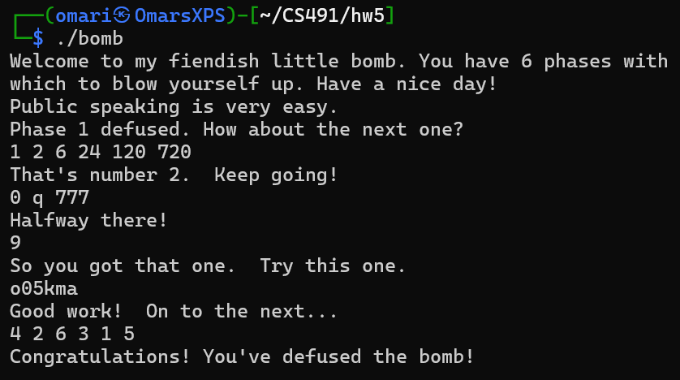
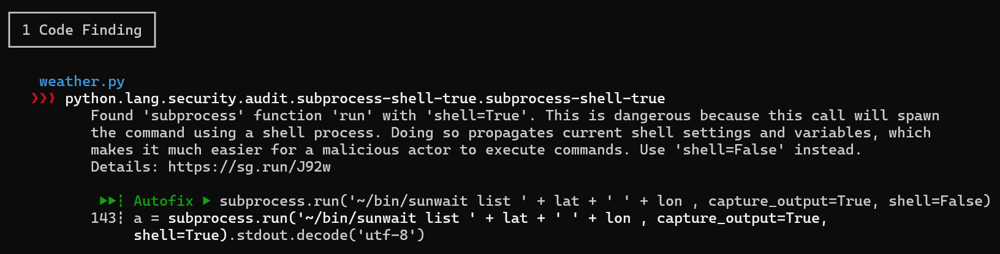
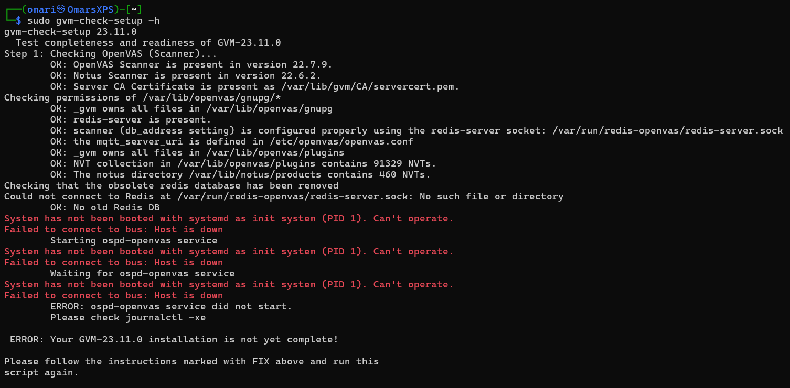

**Odin ID:** nassar

# 1


1. Used IDA and found the offset: 

```
push    offset aPublicSpeaking ; "Public speaking is very easy."
```

2. Looked at code in IDA saw that it reads six numbers broken apart by spaces. Then it goes into a loop that checks the six numbers. The loop starts with the number 1, and every iteration it adds 1 and multiplies it by the previous number (factorial). So this is basically 1!, 2!, 3!...6!

3. This is a switch case. The input is a `int`, `char`, then `int` again. The first int is the case number, then the next two parts of the inputa re the checked for each case. Technically you can put any case then put the accompanying `char` and `int`. I also found this out with IDA.

4. This step checks the input with a function called `func4`. `func4` is basically the fibonnaci sequence, but starting from "1 1" instead of "0 1" as the base cases. The goal is to find how many iterations will give the number 55, and it is 9 iterations.

5. I solved this step using gdb. I found the spot where it spits out the letter after it is converted to another letter, and mapped it out to what letter it changes to. This is the dumb way of doing it, but I couldn't figure it out otherwise.

6. I solved this using gdb as well. I saw two lines which I'll put below. I then used these to check what is in `edx` and what's in `eax`. I found that `eax` is the previous node and `edx` is the current node. If the order is not decending, the bomb blows up. I wasn't able to find the values of the nodes in a very smart way using IDA, so I did this the dumb way and kept trying just making the two first numbers different to see the values of all the nodes.

```
0x8048e75 <phase_6+221> cmp    (%edx),%eax
0x8048e77 <phase_6+223> jge    0x8048e7e <phase_6+230> 
```


All my work going through this programs is in the file 'Step1.txt'. The final answers are:

1. `Public speaking is very easy.`
2. `1 2 6 24 120 720`
3. `0 q 777`
4. `9`
5. `o05kma`
6. `4 2 6 3 1 5`

# 2


# 3

I installed semgrep on my kali VM, and ran it against `weather.py`, a default example file in kali. I used this command: `semgrep --config=https://semgrep.dev/p/r2c-security-audit weather.py`, which uses the rules for security. Semgrep was able to find one vulnerability. 



# 4

I was unable to set up gvm. I talked to other students in the class and they were also unable to set it up.

